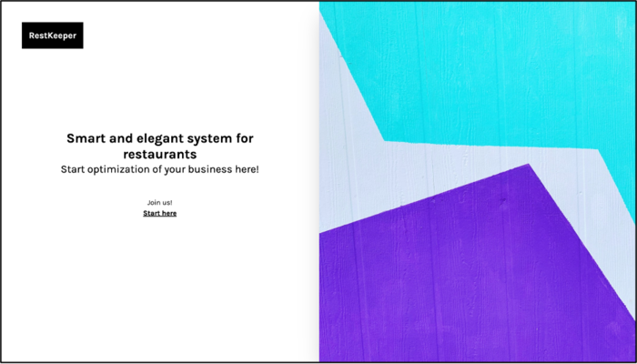
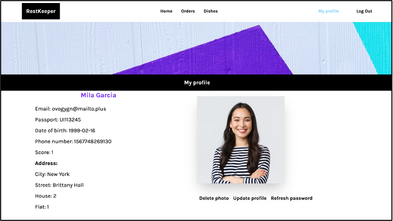
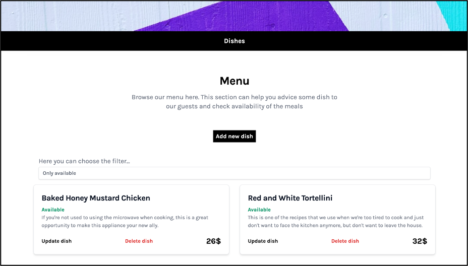
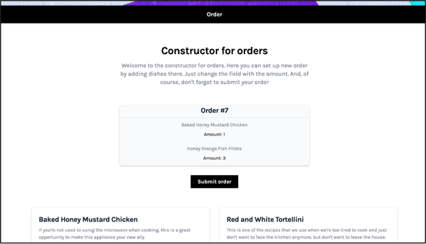
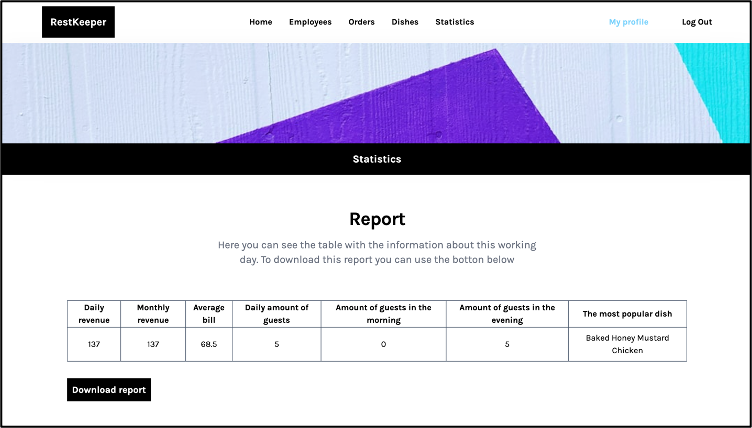

[](https://www.rultor.com/p/hizmailovich/RestKeeper)
<br>

[](https://github.com/hizmailovich/RestKeeper/actions/workflows/maven.yml)
[](https://hitsofcode.com/view/github/hizmailovich/rest-keeper)
[](https://github.com/hizmailovich/rest-keeper)

Project architect: [@hizmailovich](https://github.com/hizmailovich)

Smart and elegant system for restaurants "RestKeeper" [Backend]. See frontend part [here](https://github.com/hizmailovich/rest-keeper-ui).

**Problem:** Currently, the restaurant business is developing quite rapidly. As a result, the competition between establishments increases, hence the competition for potential visitors, which entails an increase in the requirements for business strategy.

**Solution:** Use "RestKeeper" to automate your business.

## Quick Start
Run this script to start containers locally:
```shell
$ sh local.sh
```

## Screenshots

Start page:
<br>



Profile page:
<br>



Dishes page:
<br>



Orders page:
<br>



Statistics page:
<br>



## Glossary
`Address` - information about user's address.

`Artifact` - image object.

`AthEntity` - information for authentication (email, password, tokens and so on).

`Dish` - information about every dish.

`Order` - information about order.

`Statistics` - information about results of working day.

`User` - information about employee.

## How to Contribute

Fork repository, make changes, send us a [pull request](https://www.yegor256.com/2014/04/15/github-guidelines.html).
We will review your changes and apply them to the `master` branch shortly,
provided they don't violate our quality standards. To avoid frustration,
before sending us your pull request please run full Maven build:

```bash
$ mvn clean install
```

You will need Maven 3.8.7+ and Java 17+.

Our [rultor image](https://github.com/eo-cqrs/eo-kafka-rultor-image) for CI/CD.